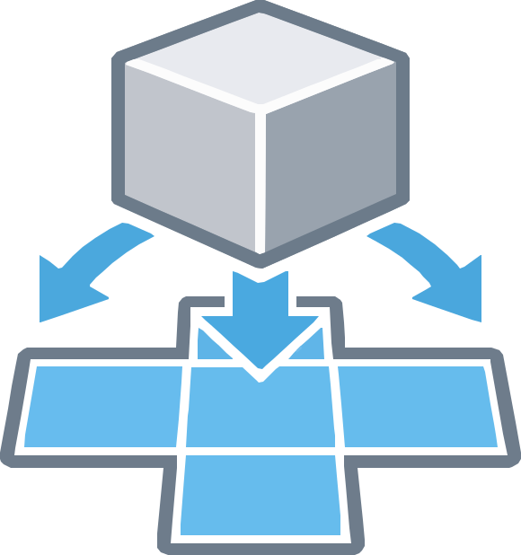
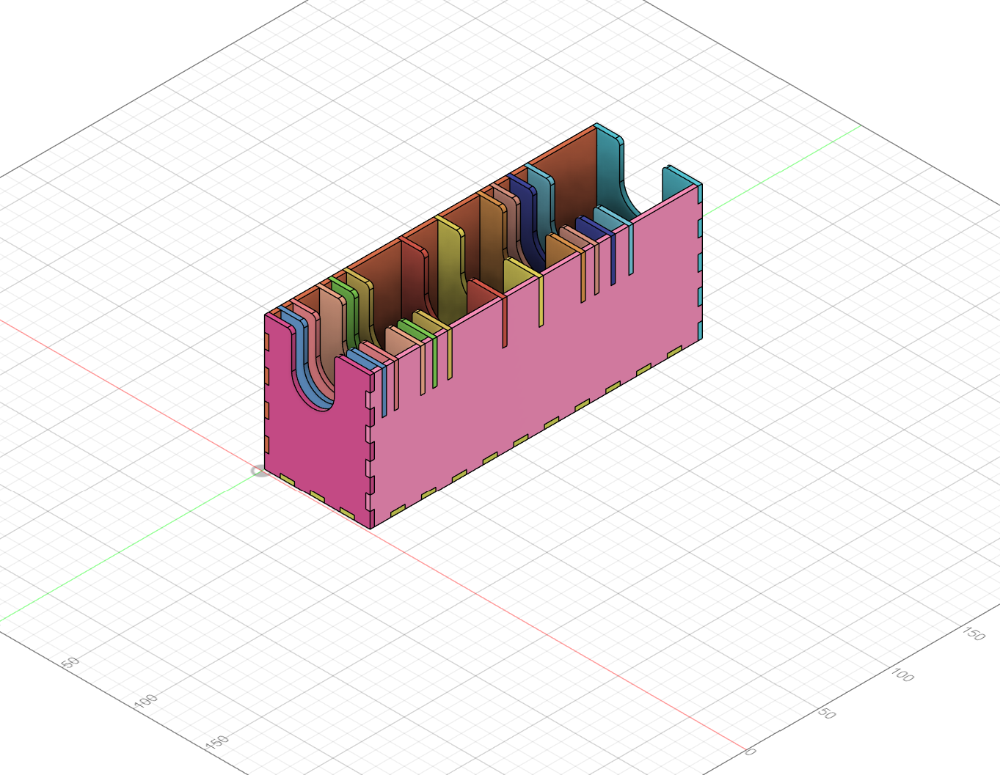
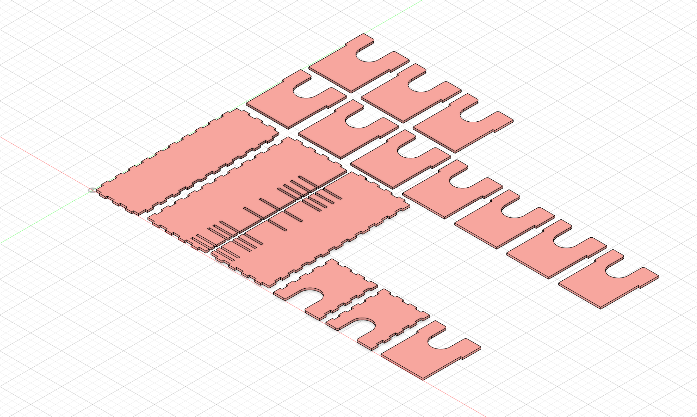

# Flatten & Layout



**Flatten & Layout** is an [Autodesk Fusion](https://www.autodesk.com/products/fusion-360/overview) add-in that takes selected components, identifies the largest flat (planar) face on each visible body, rotates every body so that face points downward, and then arranges them all in a tidy, non-overlapping grid inside a new component. It is ideal for preparing parts for laser cutting, CNC milling, or any workflow where you need a flat, laid-out view of your parts.

## Before & After

| Before | After |
|--------|-------|
|  |  |

## Features

- Copies all visible bodies from one or more selected components.
- Automatically detects the largest planar face on each body and orients it flat.
- Arranges all bodies in a clean grid with configurable padding.
- Optionally creates **one flattened component per selected component** (useful when you want to keep parts separated).
- Non-destructive — the original components are never modified.

## Installation

### Using the install script (recommended)

1. Open a PowerShell terminal in the repository root.
2. Run:

   ```powershell
   .\src\install.ps1
   ```

   The script copies the `Flatten-Layout` folder to:

   ```text
   %APPDATA%\Autodesk\Autodesk Fusion 360\API\AddIns\
   ```

### Manual copy

Copy the `src\Flatten-Layout` folder (including all its contents) to:

```text
%APPDATA%\Autodesk\Autodesk Fusion 360\API\AddIns\
```

The final path should look like:

```text
%APPDATA%\Autodesk\Autodesk Fusion 360\API\AddIns\Flatten-Layout\Flatten-Layout.py
```

## Enabling the add-in in Autodesk Fusion

1. Open Autodesk Fusion.
2. Go to **Utilities** → **Add-ins** (or press **Shift+S**).
3. Switch to the **Add-ins** tab.
4. Find **Flatten-Layout** in the list and click **Run**. To load it automatically on every start, check **Run on Startup**.

## Using the command

Once enabled, the **Flatten & Layout** command appears in the **Design** workspace under:

**Solid** → **Modify** → **Flatten & Layout**

1. Select one or more components in your design.
2. Optionally change the output component name or enable **One component per selection**.
3. Click **OK**. A new component containing all flattened bodies arranged in a grid will be created in the root component.

## License

See [LICENSE](LICENSE).
